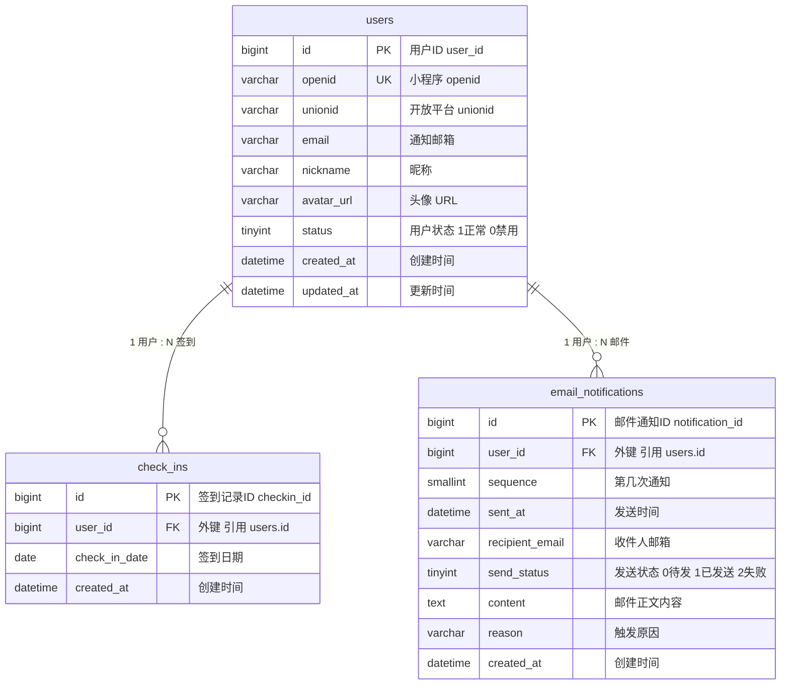

# 死了么 - 数据库设计文档

## 1. 文档说明

| 项目     | 说明                     |
|----------|--------------------------|
| 产品名称 | 死了么                   |
| 文档类型 | 数据库模式设计文档       |
| 设计原则 | 第三范式（3NF）、最小冗余、高一致性 |
| 目标数据库 | MySQL 5.7+ / PostgreSQL 12+ |

---

## 2. 业务流程简述

- **核心功能**：用户需每日签到；若**连续 2 天**未签到，系统向用户指定的邮箱发送提醒邮件。
- **关键规则**：
  - 每个用户每天至多签到一次（按自然日）。
  - “连续 2 天未签到”指：以当前日期为 T，若用户**最后一次签到日期 < T-1**（即昨天和今天都没有签到），则触发邮件。
  - 同一自然日内对同一用户只发送一封提醒邮件，需有发送记录用于去重与审计。
- **用户状态**：TINYINT，1=正常，0=禁用（含停止、有情况；停止=用户取消签到或删除应用，有情况=已发满 5 封提醒仍未签到）。
- **邮件通知记录**：每条记录表示一次通知，记录**第几次通知**、**发送时间**；某用户“通知过几次”= 该用户在 `email_notifications` 中的记录数。

---

## 3. 业务实体分析

| 实体         | 说明                     | 主要属性 |
|--------------|--------------------------|----------|
| **用户**     | 小程序用户，绑定接收提醒的邮箱 | 用户标识(openid/unionid)、用户名称(昵称)、邮箱、头像、**用户状态** TINYINT(1=正常，0=禁用)、账号创建/更新时间 |
| **签到记录** | 用户在某一自然日的签到行为   | 用户、签到日期(自然日)、签到时间(记录创建时间)；同一用户同一天仅一条 |
| **邮件通知记录** | 因连续未签到或活动等触发的提醒邮件记录 | 收件人(用户)、收件邮箱、**第几次通知**、**发送时间**、发送状态、邮件正文内容、触发原因 |

---

## 4. 实体关系

- **用户 ∶ 签到记录** = **1 ∶ N**（一个用户有多条签到记录）
- **用户 ∶ 邮件通知记录** = **1 ∶ N**（一个用户可收到多封提醒邮件）
- 签到记录与邮件通知记录之间无直接外键关联，通过“用户 + 时间”在业务逻辑中关联。

---

## 5. 数据库关系图（ER 图）

### 5.2 关系说明（谁引用谁）

| 从表（子表） | 从表主键 ID | 外键字段 | 引用主表 | 主表主键 ID | 关系类型 | 含义 |
|--------------|--------------|----------|----------|-------------|----------|------|
| **check_ins** | checkin_id | user_id | users | user_id | **1 : N** | 一条签到记录属于一个用户；一个用户有多条签到记录 |
| **email_notifications** | notification_id | user_id | users | user_id | **1 : N** | 一条邮件记录对应一个用户；一个用户可收到多条邮件记录 |

- **主表**：users（被引用方）
- **从表**：check_ins、email_notifications（通过 user_id 引用 users.id）

### 5.3 表与主键 ID 一览（设计师用）

| 表名 | 主键字段 | ID 标识（设计师用名） |
|------|----------|------------------------|
| users | id | **user_id**（用户ID） |
| check_ins | id | **checkin_id**（签到记录ID） |
| email_notifications | id | **notification_id**（邮件通知ID） |

- 在 ER 图、字段说明、DDL 注释中统一使用上述 ID 标识。

### 5.4 完整 ER 图（Mermaid）



**图例说明：**

- `||--o{` 表示一对多（1 : N），左侧为 1，右侧为 N。
- **PK** = 主键，**FK** = 外键，**UK** = 唯一键。
- **users**：用户表；**check_ins**：签到记录表；**email_notifications**：邮件通知记录表（收件人、邮箱、通知日期、状态、触发原因）。

**邮件通知表说明：**

- 含**第几次通知**（sequence）、**发送时间**（sent_at）、收件邮箱、发送状态、邮件正文（content）、**触发原因**（reason），用于区分不同触发场景。

**触发原因（reason）取值示例：**

| 触发原因 | reason 取值示例 | 说明 |
|----------|-----------------|------|
| 连续 2 天未签到 | consecutive_2_days | 当前主逻辑 |
| 连续 N 天未签到（N>2） | consecutive_7_days 等 | 如「连续 7 天」再提醒一次 |
| 活动/节日提醒 | activity / holiday | 如节假日「记得签到」提醒 |
| 手动重发 | manual | 用户/运营点击「再发一封」 |
| 账号即将停用 | expiring | 停用前最后提醒（若需要） |

---

## 6. 表结构设计

**键类型说明**：PK = 主键，FK = 外键，UK = 唯一键；“—”= 普通字段。**ID 标识**：每张表主键在业务/设计中的叫法（user_id、checkin_id、notification_id）见 5.3。

### 6.1 用户表 `users`（主键 ID：**user_id** / 用户ID）

**本表存储信息：** 用户标识(openid/unionid)、用户名称(昵称)、邮箱、头像、**用户状态** TINYINT(1=正常，0=禁用)、创建/更新时间。

**字段说明（设计师速查表）：**

| 序号 | 字段名      | 数据类型     | 键类型 | 取值/默认     | 说明 |
|------|-------------|--------------|--------|---------------|------|
| 1    | id          | BIGINT       | PK     | 自增          | **用户ID**（user_id），主键 |
| 2    | openid      | VARCHAR(64)  | UK     | NOT NULL      | 小程序用户唯一标识 |
| 3    | unionid     | VARCHAR(64)  | —      | NULL          | 开放平台统一 id（可选） |
| 4    | email       | VARCHAR(255) | —      | NOT NULL      | 接收提醒的邮箱 |
| 5    | nickname    | VARCHAR(64)  | —      | NULL          | 昵称（用户名称） |
| 6    | avatar_url  | VARCHAR(512) | —      | NULL          | 头像 URL |
| 7    | status      | TINYINT      | —      | 1=正常，0=禁用，DEFAULT 1 | 用户状态 |
| 8    | created_at  | DATETIME     | —      | NOT NULL      | 创建时间 |
| 9    | updated_at  | DATETIME     | —      | NOT NULL      | 更新时间 |

**约束与索引：** PK = `id`；UK = `openid`；索引 = `idx_email`、`idx_status`。

---

### 6.2 签到记录表 `check_ins`（主键 ID：**checkin_id** / 签到记录ID）

**本表存储信息：** 用户ID、签到日期(自然日)、签到时间(记录创建时间)；同一用户同一天仅一条。

**字段说明（设计师速查表）：**

| 序号 | 字段名        | 数据类型 | 键类型 | 取值/默认     | 说明 |
|------|---------------|----------|--------|---------------|------|
| 1    | id            | BIGINT   | PK     | 自增          | **签到记录ID**（checkin_id），主键 |
| 2    | user_id       | BIGINT   | FK     | NOT NULL      | 外键，引用 users.id（用户ID） |
| 3    | check_in_date | DATE     | —      | NOT NULL      | 签到日期（自然日） |
| 4    | created_at    | DATETIME | —      | NOT NULL      | 记录创建时间（签到时间） |

**约束与索引：** PK = `id`；FK = `user_id` → `users(id)`；UK = `(user_id, check_in_date)`；索引 = `idx_user_id`、`idx_check_in_date`。

---

### 6.3 邮件通知记录表 `email_notifications`（主键 ID：**notification_id** / 邮件通知ID）

**本表存储信息：** 收件人(user_id)、收件邮箱、**第几次通知**(sequence)、**发送时间**(sent_at)、发送状态(send_status)、邮件正文(content)、触发原因(reason)；每条记录对应一次发送尝试；“通知过几次”= 该 user_id 在本表记录数。

**字段说明（设计师速查表）：**

| 序号 | 字段名          | 数据类型     | 键类型 | 取值/默认     | 说明 |
|------|-----------------|--------------|--------|---------------|------|
| 1    | id              | BIGINT       | PK     | 自增          | **邮件通知ID**（notification_id），主键 |
| 2    | user_id         | BIGINT       | FK     | NOT NULL      | 外键，引用 users.id（收件人/用户ID） |
| 3    | sequence        | SMALLINT     | —      | NOT NULL      | 第几次通知（该用户被提醒的序号，如 1～5） |
| 4    | sent_at         | DATETIME     | —      | NOT NULL      | 该次通知的发送时间 |
| 5    | recipient_email | VARCHAR(255) | —      | NOT NULL      | 收件人邮箱（发送时快照） |
| 6    | send_status     | TINYINT      | —      | 0=待发，1=已发送，2=失败，DEFAULT 0 | 发送状态 |
| 7    | content         | TEXT         | —      | NULL          | 邮件正文内容 |
| 8    | reason          | VARCHAR(32)  | —      | DEFAULT 'consecutive_2_days' | 触发原因 |
| 9    | created_at      | DATETIME     | —      | NOT NULL      | 记录创建时间 |

**约束与索引：** PK = `id`；FK = `user_id` → `users(id)`；索引 = `idx_user_sent`、`idx_send_status`、`idx_user_sequence`。

---

## 7. DDL 示例（MySQL）

```sql
-- 用户表（主键 ID：user_id / 用户ID）
CREATE TABLE users (
    id          BIGINT       NOT NULL AUTO_INCREMENT COMMENT '用户ID user_id PK',
    openid      VARCHAR(64)  NOT NULL COMMENT '小程序 openid UK',
    unionid     VARCHAR(64)  NULL     COMMENT '开放平台 unionid',
    email       VARCHAR(255) NOT NULL COMMENT '通知邮箱',
    nickname    VARCHAR(64)  NULL     COMMENT '昵称',
    avatar_url  VARCHAR(512) NULL     COMMENT '头像 URL',
    status      TINYINT      NOT NULL DEFAULT 1 COMMENT '用户状态: 1=正常, 0=禁用',
    created_at  DATETIME    NOT NULL DEFAULT CURRENT_TIMESTAMP COMMENT '创建时间',
    updated_at  DATETIME    NOT NULL DEFAULT CURRENT_TIMESTAMP ON UPDATE CURRENT_TIMESTAMP COMMENT '更新时间',
    PRIMARY KEY (id),
    UNIQUE KEY uk_openid (openid),
    KEY idx_email (email),
    KEY idx_status (status)
) ENGINE=InnoDB DEFAULT CHARSET=utf8mb4 COLLATE=utf8mb4_unicode_ci COMMENT='用户表';

-- 签到记录表（主键 ID：checkin_id / 签到记录ID）
CREATE TABLE check_ins (
    id            BIGINT   NOT NULL AUTO_INCREMENT COMMENT '签到记录ID checkin_id PK',
    user_id       BIGINT   NOT NULL COMMENT '用户ID FK→users.id',
    check_in_date DATE     NOT NULL COMMENT '签到日期(自然日)',
    created_at    DATETIME NOT NULL DEFAULT CURRENT_TIMESTAMP COMMENT '创建时间',
    PRIMARY KEY (id),
    UNIQUE KEY uk_user_date (user_id, check_in_date),
    KEY idx_user_id (user_id),
    KEY idx_check_in_date (check_in_date),
    CONSTRAINT fk_check_ins_user FOREIGN KEY (user_id) REFERENCES users (id) ON DELETE CASCADE
) ENGINE=InnoDB DEFAULT CHARSET=utf8mb4 COLLATE=utf8mb4_unicode_ci COMMENT='签到记录表';

-- 邮件通知记录表（主键 ID：notification_id / 邮件通知ID）
CREATE TABLE email_notifications (
    id               BIGINT      NOT NULL AUTO_INCREMENT COMMENT '邮件通知ID notification_id PK',
    user_id          BIGINT      NOT NULL COMMENT '用户ID 收件人 FK→users.id',
    sequence         SMALLINT    NOT NULL COMMENT '第几次通知 该用户被提醒的序号',
    sent_at          DATETIME    NOT NULL COMMENT '该次通知的发送时间',
    recipient_email  VARCHAR(255) NOT NULL COMMENT '收件人邮箱 发送时快照',
    send_status      TINYINT     NOT NULL DEFAULT 0 COMMENT '发送状态: 0=待发, 1=已发送, 2=失败',
    content          TEXT        NULL     COMMENT '邮件正文内容',
    reason           VARCHAR(32) NOT NULL DEFAULT 'consecutive_2_days' COMMENT '触发原因',
    created_at       DATETIME    NOT NULL DEFAULT CURRENT_TIMESTAMP COMMENT '创建时间',
    PRIMARY KEY (id),
    KEY idx_user_sent (user_id, sent_at),
    KEY idx_send_status (send_status),
    KEY idx_user_sequence (user_id, sequence),
    CONSTRAINT fk_email_notifications_user FOREIGN KEY (user_id) REFERENCES users (id) ON DELETE CASCADE
) ENGINE=InnoDB DEFAULT CHARSET=utf8mb4 COLLATE=utf8mb4_unicode_ci COMMENT='邮件通知记录表';
```

---

## 8. 设计说明

### 8.1 范式与冗余

- 设计满足**第三范式**：所有非主属性仅依赖主键，无传递依赖。
- **用户状态 `users.status`**：TINYINT，1=正常，0=禁用（含用户取消签到/删除应用、或发满 5 封仍未签到的「有情况」）。业务在发第 5 封后仍未签到时可将其置为 0。
- **邮件通知记录**：`email_notifications.sequence` 表示该用户被提醒的第几次（1～5 等），`sent_at` 表示该次通知的发送时间；“通知过几次”= 该 user_id 在 `email_notifications` 中的记录数。
- **邮件发送状态 `email_notifications.send_status`**：TINYINT，0=待发，1=已发送，2=失败；便于重试与监控。表内还存 `content`（邮件正文）、`recipient_email`（收件邮箱快照），便于审计与客服。

### 8.2 “连续 2 天未签到”的判定与去重

- **判定逻辑**：以服务器当前日期为 `today`，若用户**最后一次签到日期 < today - 1**（即昨天和今天都没有签到记录），且**今天尚未给该用户发过提醒**，则发送邮件。
- **去重**：通过 `email_notifications` 表，在同一自然日内对同一 `user_id` 仅插入一条记录，发送前查询“该用户今日是否已有记录”即可避免重复发送。

### 8.3 扩展性

- **提醒规则**：`reason` 可扩展（consecutive_2_days、consecutive_7_days、activity、holiday、manual、expiring 等）。
- **多端登录**：已预留 `unionid`，便于与公众号、APP 等统一用户。
- **时区**：`check_in_date`、`sent_at` 等建议以业务统一时区（如 UTC+8）存储。

### 8.4 性能与索引

- 定时任务扫描“连续 2 天未签到”用户时，可先按 `check_in_date` 或“最后签到日”过滤，再按 `user_id` 聚合，现有索引可支撑。

---

## 9. 小结

| 表名                 | 作用                     |
|----------------------|--------------------------|
| users                | 存储用户身份、通知邮箱、用户状态 TINYINT(1=正常，0=禁用)；主键 ID：user_id |
| check_ins            | 存储每日签到，支持“连续未签”判定；主键 ID：checkin_id |
| email_notifications  | 记录提醒邮件发送（第几次、发送时间、收件邮箱、正文、send_status 0/1/2、reason）；主键 ID：notification_id；“通知过几次”= 该用户在本表记录数 |

以上表结构在满足 3NF 的前提下，覆盖“每日签到 + 连续 2 天未签发邮件”的业务需求，并预留扩展与索引优化空间。
